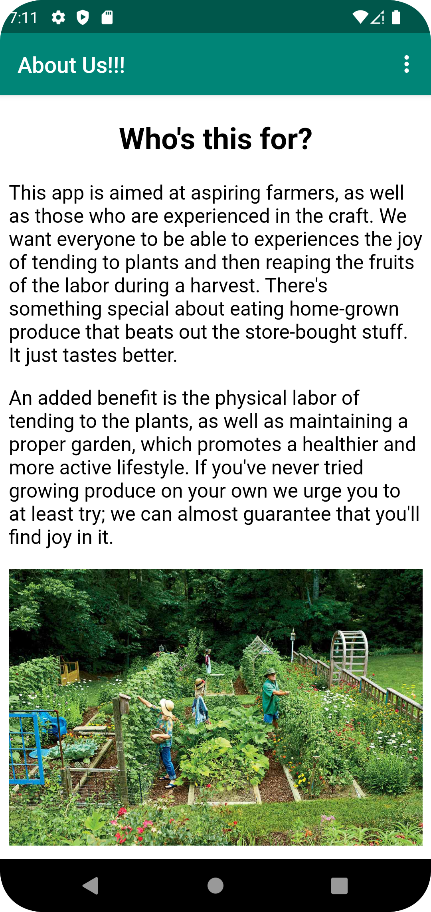

# Rapport

**Skriv din rapport här!**

Lade till en toolbar som tillät byte mellan de två aktiviteterna.

```
    public void showInternalWebPage(){
        Intent intent = new Intent(MainActivity.this, AboutActivity.class);
        startActivity(intent);
    }
    
     protected void onCreate(Bundle savedInstanceState) {
            super.onCreate(savedInstanceState);
            setContentView(R.layout.activity_main);
            Toolbar toolbar = findViewById(R.id.toolbar);
            setSupportActionBar(toolbar);
     //--Irrelevant code--
     }
 
     @Override
    public boolean onCreateOptionsMenu(Menu menu) {
        getMenuInflater().inflate(R.menu.main_menu, menu);
        return true;
    }
    
    @Override
    public boolean onOptionsItemSelected(MenuItem item) {
        int id = item.getItemId();

        if(id == R.id.action_internal_web) {
            Log.d("==>", "Will display 'About Us' internal web page in new activity");
            showInternalWebPage();
        }

        return true;
    }
    
    <?xml version="1.0" encoding="utf-8"?>
    <menu xmlns:android="http://schemas.android.com/apk/res/android"
        xmlns:app="http://schemas.android.com/apk/res-auto"
        xmlns:tools="http://schemas.android.com/tools"
        tools:context="com.example.project.MainActivity">
    
        <item
            android:id="@+id/action_internal_web"
            android:title="About Us"
            android:orderInCategory="100"
            app:showAsAction="never"/>
    
        <item
            android:id="@+id/action_main_activity"
            android:title="Available Seeds"
            android:orderInCategory="110"
            app:showAsAction="never"/>
    </menu>
```

Började med att göra "AboutActivity", där html-filen laddades in.

```
    public class AboutActivity extends AppCompatActivity {
    
    
        private void showExternalWebPage() {
            Intent intent = new Intent(AboutActivity.this, MainActivity.class);
            startActivity(intent);
        }
    
        @Override
        protected void onCreate(Bundle savedInstanceState) {
            super.onCreate(savedInstanceState);
            setContentView(R.layout.activity_about);
    
            WebView myWebView = (WebView)findViewById(R.id.aboutView);
    
            myWebView.loadUrl("file:///android_asset/about.html");
    
            getSupportActionBar().setTitle("About Us!!!");
    
        }
    
        @Override
        public boolean onCreateOptionsMenu(Menu menu) {
            getMenuInflater().inflate(R.menu.main_menu, menu);
            return true;
        }
    
        @Override
        public boolean onOptionsItemSelected(MenuItem item) {
            int id = item.getItemId();
    
    
            if(id == R.id.action_main_activity){
                Log.d("==>", "Opens Main activity");
                showExternalWebPage();
            }
    
            return true;
        }
    }
```

Skapade sedan en Recycler View i MainActivity, och allt som den behöver.

```
    <androidx.recyclerview.widget.RecyclerView
        android:id="@+id/produceList"
        android:layout_width="0dp"
        android:layout_height="0dp"
        app:layout_constraintTop_toBottomOf="@id/appBarLayout"
        app:layout_constraintBottom_toBottomOf="parent"
        app:layout_constraintStart_toStartOf="parent"
        app:layout_constraintEnd_toEndOf="parent" />
        
    <LinearLayout xmlns:android="http://schemas.android.com/apk/res/android"
    android:layout_width="match_parent"
    android:layout_height="wrap_content"
    android:orientation="vertical"
    android:paddingBottom="15dp"
    android:paddingTop="1dp">

        <TextView
            android:id="@+id/itemTitle"
            android:layout_width="wrap_content"
            android:layout_height="wrap_content"
            android:textAppearance="?android:attr/textAppearanceMedium"
            android:text="Title" />
    
        <TextView
            android:id="@+id/itemCategory"
            android:layout_width="wrap_content"
            android:layout_height="wrap_content"
            android:text="Category" />
    
        <TextView
            android:id="@+id/itemSize"
            android:layout_width="wrap_content"
            android:layout_height="wrap_content"
            android:text="Size" />
    
        <TextView
            android:id="@+id/itemCost"
            android:layout_width="wrap_content"
            android:layout_height="wrap_content"
            android:text="Cost" />
    
        <TextView
            android:id="@+id/itemAuxData"
            android:layout_width="wrap_content"
            android:layout_height="wrap_content"
            android:text="Auxiliary Data" />

    </LinearLayout>
    
@SuppressWarnings("FieldCanBeLocal")
public class MainActivity extends AppCompatActivity implements JsonTask.JsonTaskListener {

    private final String JSON_URL = "https://mobprog.webug.se/json-api?login=a22nevan";
    private final String JSON_FILE = "projectJSON.json";
    private ArrayList<Produce> produceArrayList = new ArrayList<>();

    Gson gson = new Gson();

    RecyclerViewAdapter adapter;
    
     protected void onCreate(Bundle savedInstanceState) {
        super.onCreate(savedInstanceState);
        setContentView(R.layout.activity_main);
        Toolbar toolbar = findViewById(R.id.toolbar);
        setSupportActionBar(toolbar);
        getSupportActionBar().setTitle("Buy our plants!!!");

        adapter = new RecyclerViewAdapter(this, produceArrayList, new RecyclerViewAdapter.OnClickListener() {
            @Override
            public void onClick(Produce item) {
                Toast.makeText(MainActivity.this, item.getName(), Toast.LENGTH_SHORT).show();
            }
        });

        RecyclerView view = findViewById(R.id.produceList);
        LinearLayoutManager layoutManager = new LinearLayoutManager(this);
        layoutManager.setOrientation(RecyclerView.VERTICAL);
        view.setLayoutManager(layoutManager);
        view.setAdapter(adapter);

        new JsonFile(this,this).execute(JSON_FILE);
        //new JsonTask(this).execute(JSON_URL);
    }
    
    @Override
    public void onPostExecute(String json) {
        Log.d("MainActivity", "JSON data received: " + json);
        Type type = new TypeToken<List<Produce>>() {}.getType();
        produceArrayList = gson.fromJson(json, type);
        adapter.setItems(produceArrayList);
        adapter.notifyDataSetChanged();
    }
}

```

(RecyclerViewAdapter)

```
package com.example.project;

import android.content.Context;
import android.util.Log;
import android.view.LayoutInflater;
import android.view.View;
import android.view.ViewGroup;
import android.widget.TextView;

import java.util.List;

import androidx.annotation.NonNull;
import androidx.recyclerview.widget.RecyclerView;

public class RecyclerViewAdapter extends RecyclerView.Adapter<RecyclerViewAdapter.ViewHolder> {

    private List<Produce> items;
    private LayoutInflater layoutInflater;
    private OnClickListener onClickListener;

    RecyclerViewAdapter(Context context, List<Produce> items, OnClickListener onClickListener) {
        this.layoutInflater = LayoutInflater.from(context);
        this.items = items;
        this.onClickListener = onClickListener;
    }

    @Override
    @NonNull
    public ViewHolder onCreateViewHolder(@NonNull ViewGroup parent, int viewType) {
        return new ViewHolder(layoutInflater.inflate(R.layout.listitem, parent, false));
    }

    @Override
    public void onBindViewHolder(ViewHolder holder, int position) {
        Produce produce = items.get(position);
        Log.d("RecyclerViewAdapter", "Binding item at position " + position + " with name: " + produce.getName());
        holder.title.setText(produce.getName());
        holder.category.setText("Type: " +produce.getCategory());
        holder.size.setText("Height: " + String.valueOf(produce.getSize()) + "cm");
        holder.cost.setText("Price: " + String.valueOf(produce.getCost()) + " kr");
        holder.auxData.setText("Harvesting Season: " + produce.getAuxData());
    }

    @Override
    public int getItemCount() {
        return items.size();
    }

    public class ViewHolder extends RecyclerView.ViewHolder implements View.OnClickListener {
        TextView title;
        TextView category;
        TextView size;
        TextView cost;
        TextView auxData;

        ViewHolder(View itemView) {
            super(itemView);
            itemView.setOnClickListener(this);
            title = itemView.findViewById(R.id.itemTitle);
            category = itemView.findViewById(R.id.itemCategory);
            size = itemView.findViewById(R.id.itemSize);
            cost = itemView.findViewById(R.id.itemCost);
            auxData = itemView.findViewById(R.id.itemAuxData);
        }

        @Override
        public void onClick(View view) {
            onClickListener.onClick(items.get(getAdapterPosition()));
        }
    }

    public interface OnClickListener {
        void onClick(Produce item);
    }

    public void setItems(List<Produce> items) {
        this.items.clear();
        this.items.addAll(items);
    }


}
```

Vet fortfarande inte om koden som hanterar URL funkar, då jag inte kunnat testa det på skoldatorerna.


